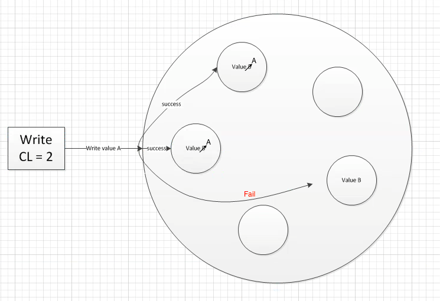
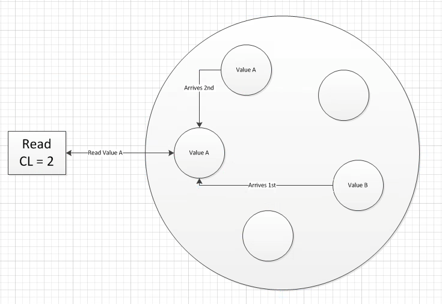

The latest database to be big on the market comes with a very surprising twist. It is not consistent. Thats right, surprising indeed. Cassandra guarantees availability and allows for partitioned data at the sacrifice of data consistency. Running this database in a high volume production environment will yield data loss. This could have negative business impact. Well, why even bother - who would want that? Lets understand the tradeoffs & then we can make the right decision. 

Firstly, a quick primer on the Cassandra essentials. A Cassandra cluster, which contains many nodes, uses the concept of a partition key to store data. When performing a write, a certain portion of the data (think column or columns) will be run through a partitioner function to return a hashed value. This hash value determines what node the data will be stored on. The whole cluster is responsible for the set of all possible hashes, where each node is responsible for a subset of the total. When performing a write, the data is sent to a Cassandra node, it is hashed, and then it is passed along to the node whose hash storage responsibility range contains this latest record. Reading follows a similar process - pass in the partition key, hash it, and ask the node responsible for this hash for the record. This simple underlying design generally makes queries quite fast.

What does eventual consistency mean and how does it work? The two keys are properties: replication factor and consistency level. Replication factor is a cluster level property, which tells Cassandra how many nodes should store each record. Setting this to 3 will ensure that 3 nodes save each record on a write. This sounds great! But how do we know all writes succeeded? Or did any of them? Enter consistency level. This parameter is set by the client performing the operation on Cassandra. If a Cassandra cluster has a replication factor of 3, a client can issue a write command with a consistency level of 2. This would require 2 replica data nodes to successfully write the data before Cassandra tells the client it was successful. A consistency level of one would only require one replica to respond. And setting the level to 3 would require all replicas to respond successfully to consider the write good. This allows you to tune the consistency vs latency for each request, based on the data Cassandra is storing.

The most common use case is to choose a consistency level of ‘quorum’, meaning the average + 1 of replica nodes must agree before the request is successful. If one would like to ensure a strong consistency level, they would use a read replica and write replica sum that is greater than the replication factor of the cluster. Going back to our 5 node cluster example, if all operations were executed with a consistency level of quorum, then, in most cases, data returned would be consistent.

Data inconsistency scenarios can happen. Lets explore this in more detail and examine what can be done on a configuration level to minimize the possibility of it occurring. Revisiting our example cluster, lets say Bob executes a write operation with consistency level of quorum. Under the hood, Cassandra will send the record to the three replica nodes given by the record’s partitioned hash value. The first two are successful, and our consistency level is met, so Cassandra tells Bob his write works. Hurray! The last write fails. But this is okay for now- 2/3 replica nodes have the correct information. When Cassandra receives a write request, it does not immediately write to disk however. Each node stores all data in memory, for a tunable (default 10 second) time period until a flush to disk occurs. Lets say Bob’s write occurs on one of the successful nodes immediately after a disk flush occurred. Then the machine dies. Suddenly, we are left with a single Node with the correct data. This is obviously not ideal. 

This situation, and others like it, can be avoided by tuning the flush period in which Cassandra writes to disk as well as by setting a system level agreement for how long a Node is ‘allowed’ to be down for. 

So now that we know the basics, lets talk about a few pitfalls that can occur in a production environment. Choosing a poor partition key for a data set can lead to very high latency in reads. Each partition gets synced to a single memory block on disk. Partition keys should be unique enough to keep this memory block small. Otherwise, when it is too large, Cassandra must compare each read request with a where clause to all possible records within the memory block of a partition key. This can be thought of as stepping through a large list and checking if each item fits the criteria as all records submitted with the same partition key are stored in the same partition. The second most common production level issue occurs when running a repair uses too many resources to the point where Cassandra becomes slow or causes failure amongst a subset of nodes. Lets explore this concept a little failure. 

The concept of repair in Cassandra refers to synchronizing data across all replica sets. As data is not guaranteed to be consistent across all replicas, Cassandra will run a backend process to remedy this. Essentially, Cassandra will create a tree out of all partitions within the system and step through it and comparing record values. If it finds any inconsistencies it will synchronize across replica factors by using the value stored on the majority of nodes. In the case where each node stores a different value, the most recent write timestamp is used to propagate data from one replica node to the rest. Under the hood, Cassandra’s repair will sync all records of a single partition into a single memory block (SS Table) and remove data that is marked for deletion.

Cassandra allows for the administrator to choose a different repair strategy when setting up the cluster. If your data set’s partition key is a system generated time based value and you are never going to see repeatable partition keys, it may be worth exploring the ‘delta’ repair strategy that only runs repair on the new data that has entered the cluster since the pervious repair. This will reduce repair time and resource usage by this process drastically- thus again showing how the data set has a large impact on how Cassandra should be configured. 

Lastly, Cassandra isn’t right for everyone. One must consider tradeoffs between read latency, availability, and data consistency. A high level of consistency can be achieved, however, it puts a lot of responsibility on the client to enforce this via the consistency level parameter that accompanies each request. Additionally, all queries can only be made with the partition key of the data set, as this key directs the cluster to the node that stores the data, but also means no joins or classic relational operations. Data modeling is extremely important and will have a significant impact on the performance of the cluster due to the size of each partition and the query pattern for how data will be obtained by the client. There are many tradeoffs to make when thinking of using this database. 

But if the business need is to serve and support an extremely high data volume, do it with very low latency, and always be available to do so than I would definitely think Cassandra may be your solution.