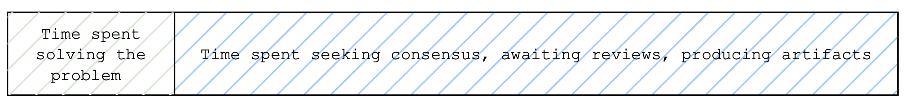
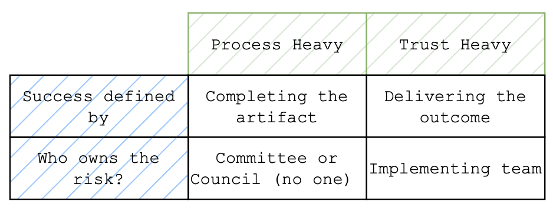

Enterprise software failures have a unique quality: they linger. Multi-million-dollar programs [limp along for years](https://www.it-cisq.org/cisq-files/pdf/CPSQ-2020-report.pdf), [producing underwhelming results](https://www.mckinsey.com/~/media/McKinsey/dotcom/client_service/Corporate%20Finance/MoF/PDF%20issues/PDFs%20Issue%2045/Final/MoF45_LargeScaleIT.ashx) that require constant justification while teams quietly absorb the drag. There are always exceptions. Certain projects operate outside the process monolith as executives fight for value faster believing the only way to innovate is to drop all process and start anew. 

That belief is comforting. And wrong.

When enterprise software fails, its rarely because the organization lacks intelligence, talent or budget. Somewhere between planning and execution, focus erodes. Priorities blur. The north star, measurably serving users, then gets lost.

### Coordination, Trade-offs, and the Role of Process

To build software, business partners must work with technology teams to identify the problem (no small feat). Then the teams specializing in engineering, product, design & project delivery decompose the problem into smaller pieces, prioritize those pieces based on value, risk, time and capacity, implement solutions, package and deploy the solutions, and then operate and support the system over time. Design decisions must be made. Risks must be understood and managed. Trade-offs are unavoidable. Industry standard [delivery methodology is implemented](https://arxiv.org/pdf/1903.10913) as a coordination mechanism. Cohesion is its purpose - ensuring everyone understands what matters now, what comes next, and why. And at each decision point, consensus, ranging from unilateral to democratic, must be achieved.

Enterprise software has another key set of stakeholders: central functions that aim to increase predictability, provide risk mitigation expertise, and reduce rework across the organization. Examples include permutations of teams that provide deep knowledge in Disaster Recovery & Backup, Cybersecurity, Architecture, Data Governance - to name a few.

This structure goes wrong when process is used to compensate for mistrust and misaligned incentives. When systems come under scrutiny through visible failures, escalations, or external review, judgement is replaced by artifacts as leadership accountability for outcomes quietly shifts toward survival.  

<em>We pay in time when we dont trust teams to reason about risk</em>

### Checklist Governance and the Cost of Mistrust

Consider disaster recovery. Centralized disaster-recovery checklists exist not because they are the best way to manage risk, but because large organizations struggle to **trust** teams to reason about risk that varies by context. That mistrust *is understandable*: outages cause reputational damage, clients leave, and many organizations carry scars from past failures. Over time, fear hardens into policy. Disaster recovery becomes framed as a compliance artifact rather than what it actually is: a business decision with explicit trade-offs between cost, complexity, and acceptable loss. The result is predictable. Teams optimize for passing audits instead of reducing real failure modes. Applications are delayed not because risk is unacceptable, but because documentation is incomplete. Meanwhile, accountability diffuses: when everyone follows the checklist, no one truly owns the outcome. A healthier model shifts the balance toward trust while retaining expertise. Central DR teams remain essential: not as gatekeepers, but as providers of deep knowledge, tooling, and reference architectures. Product and engineering teams make explicit decisions about recovery posture and are accountable to stakeholders for the consequences: downtime, data loss, and recovery time. Replace static checklists with documented, evolving conversations that tie risk decisions to business impact. When incentives align, no additional process is required. We need clarity about who decides, who advises, and who bears the cost when reality intervenes.

<em>Is accountability buried in process or assigned to a single person?</em>

### Where Trust Alone Is Not Enough

There are, of course, environments where trust alone is insufficient. Regulated financial systems executing trades or producing regulatory reports, safety-critical software in aviation or medicine, and platforms underpinning legal obligations all require more than informal reasoning. In these domains, process exists to create _provable behavior_: evidence that systems do what they claim under defined conditions. But even here, excessive process is still compensating for unclear ownership, poorly articulated risk, or incentives misaligned with outcomes. Heavyweight controls are added not because the work is inherently slow, but because it is hard to confidently answer who is accountable when assumptions fail. Ironically, the same clarity that enables trust also enables compliance. Clear ownership of risk under uncertainty allows teams to design controls that are both auditable and efficient. Provable behavior does not require maximal bureaucracy; it requires explicit decisions, traceable reasoning, and accountability that survives scrutiny. When those are present, regulated systems can move faster, not despite process, but because it is precise rather than performative.

### The Question of Accountability

Enterprise software fails when trust erodes, accountability blurs, and process fills the vacuum. The sustainable middle ground is not the elimination of central expertise or governance, but the alignment of three forces: deep functional expertise, empowered local decision-making, and incentives that reward outcomes rather than artifacts. This raises the question for anyone operating inside a large organization: what role do _you_ play in that system? If your expertise is enforced rather than welcomed, consider engaging through conversation instead of analysis; partner before you prescribe. If you find yourself unable to make decisions without layers of sign-off, ask whether risk is being communicated clearly under uncertainty, including what happens if assumptions break. And if teams around you seem incapable of making sound decisions, look beyond competence to incentives: what is actually being measured, rewarded, or punished? Enterprise velocity is not unlocked by choosing the right methodology. It is unlocked when trust is earned, accountability is explicit, and process resumes its proper role as a tool, never a substitute, for judgment.
